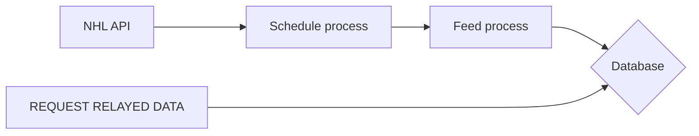

## Sportradar advanced challenge Solution
https://github.com/sportradarus/sportradar-advanced-challenge
  

### Application Workflow

- When the application starts up, it fetches the game schedules from NHL web API.

- The application then iterates through the list of games and sets up a cron job for each game based on its start time. The cron job is set up to run a specific command at the scheduled time.

- At the scheduled time, the cron job triggers a process that checks the status of the game. If the game is live, the process triggers another action to watch for the game feed and store the game data.

### Setup

 1. Running with Docker
	Prerequisites:
	- Install Docker and have it running.
	
	**RUNNING**
	`docker compose up -d --build`
	
	To run the pipeline with sample data from the NHL API, simply use the application in debug mode.
	`export SCHEDULE_DATE=2023-03-31 MODE=debug && docker compose up -d --build`
	
	**FETCH GAMES**
	- For fetching all games
		`docker exec -it pipeline rake games`
	- For fetching a particular game by ID
		`docker exec -it pipeline rake games game_id=GAMEID`
	- For fetching games by season
		`docker exec -it pipeline rake games season=SEASONIDENTIFIER`

	**TESTING**

	`docker exec -it pipeline rake test`

	**STOPPING**

	`docker compose down && docker rmi nhl_pipeline --force && docker volume rm nhl-data-pipeline_db-volume`

2. Executing the application locally without utilizing Docker
	Prerequisites
	- Install ruby v3.1.1
	- Install postgreSQL

	In the project directory create an **.env** file similar to the **.env.example** file shared in the project.
	Then:
	`bundle install`
	`rake db:create`
	`rake db:migrate`
	
	**RUNNING**
	`rake dev`
	
	To run the pipeline with sample data from the NHL API, simply use the application in debug mode.
	`rake dev_debug`
	
	**FETCH GAMES**
	- For fetching all games
		`rake games`
	- For fetching a particular game by ID
		`rake games game_id=GAMEID`
	- For fetching games by season
		`rake games season=SEASONIDENTIFIER`

	**TESTING**
	`rspec`
	